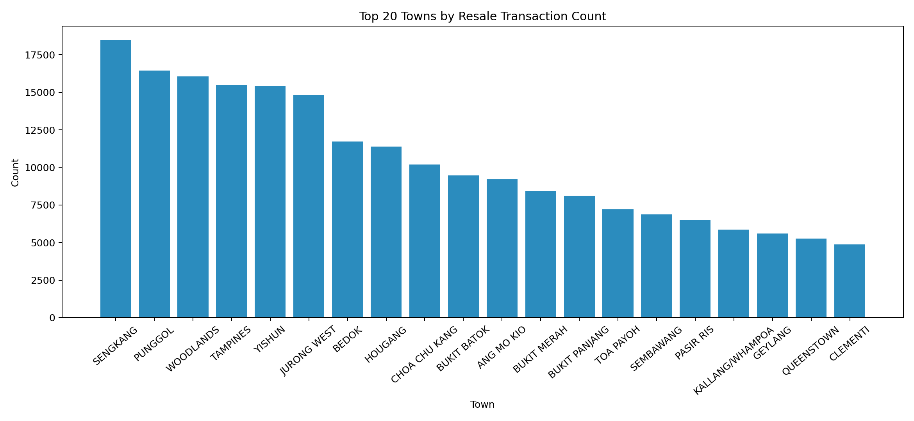
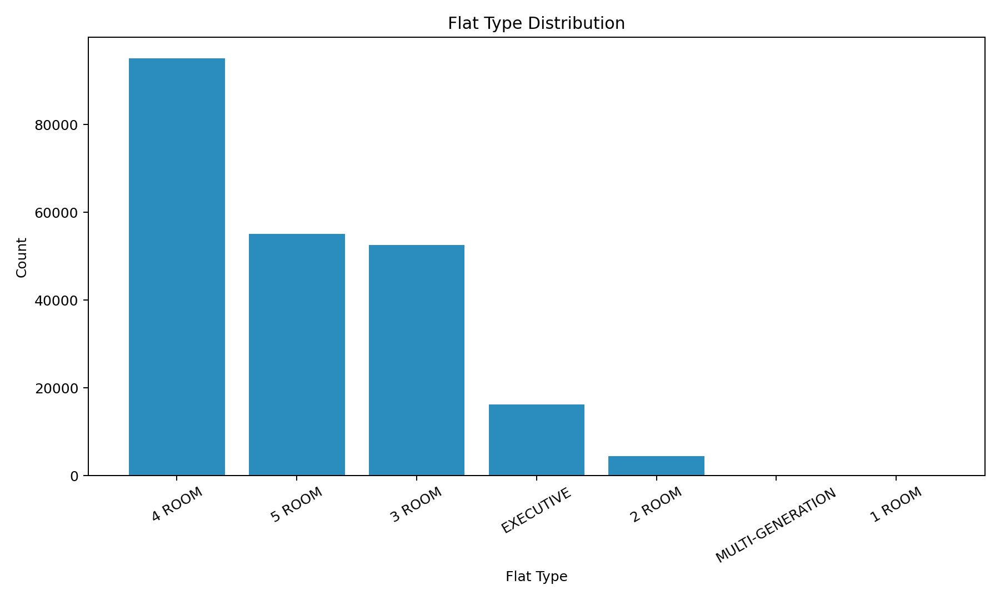
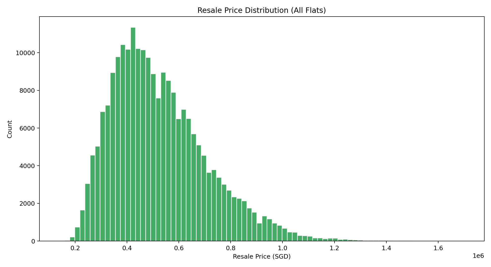
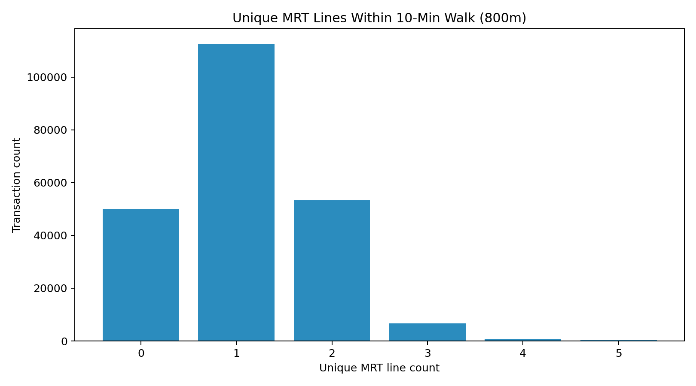
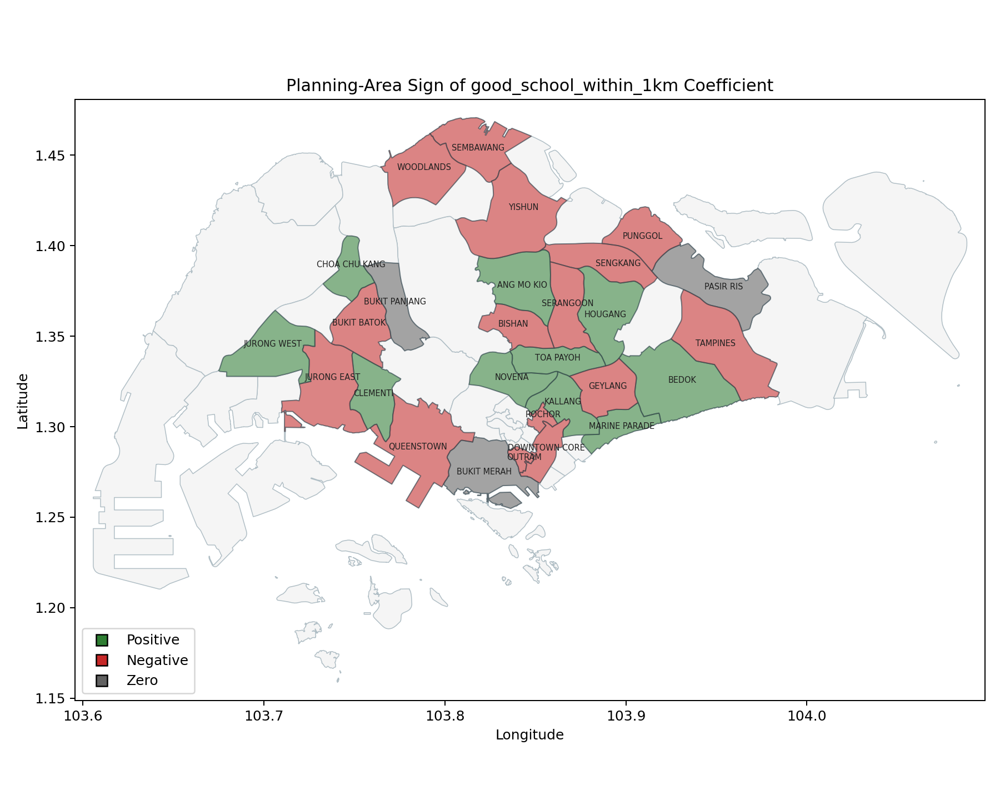

# Technical Report: Estimating the HDB Resale Price Effect of Proximity to Oversubscribed Primary Schools

## 1. Context

Housing demand in Singapore is strongly shaped by access to public amenities, and school access has become a recurring policy and public concern. In practice, households often treat proximity to competitive primary schools as a key criterion when selecting resale flats. From a Ministry of National Development (MND) perspective, this creates a practical policy question: how much of observed resale price variation is associated with school-access effects, and how much is explained by other structural and accessibility factors.

This project was initiated to support that question with an auditable, data-driven workflow. The objective is not only predictive performance, but also policy interpretability: if we quantify a school-access premium, we need to understand when it appears, where it appears, and whether it remains after controlling for confounders.

The implementation evolved across branches in the repository:

| Branch | Role in project |
|---|---|
| [`main`](https://github.com/heehawww/DSA4264_Geospatial_Group6/tree/main) / `webscraper` | Initial MOE school-data scraping setup |
| [`Web_Crawler`](https://github.com/heehawww/DSA4264_Geospatial_Group6/tree/Web_Crawler) | Crawler refinements for school-vacancy and balloting extraction |
| [`Data-Preprocessing`](https://github.com/heehawww/DSA4264_Geospatial_Group6/tree/Data-Preprocessing) | Geospatial integration and feature engineering pipeline |
| [`Hedonic-Model`](https://github.com/heehawww/DSA4264_Geospatial_Group6/tree/Hedonic-Model) | Hedonic regression, boundary RDD, and town-level heterogeneous-effect analysis |

Content under `main`/`webscraper` is limited to the legacy crawler module (`Webscrapper/primaryschoolscrap/...`) and an early `schools.csv` snapshot. It serves primarily as project lineage for raw school-vacancy extraction, while the active production preprocessing and modelling workflows are maintained in `Data-Preprocessing` and `Hedonic-Model`.

Within `Data-Preprocessing`, the core geospatial workflow is implemented in:

- [`primary_boundaries/join_primary_schools_to_ura_landuse.py`](https://github.com/heehawww/DSA4264_Geospatial_Group6/blob/Data-Preprocessing/primary_boundaries/join_primary_schools_to_ura_landuse.py)
- [`primary_boundaries/build_resale_flat_school_dataset_onemaps.py`](https://github.com/heehawww/DSA4264_Geospatial_Group6/blob/Data-Preprocessing/primary_boundaries/build_resale_flat_school_dataset_onemaps.py)

Within `Hedonic-Model`, model estimation is implemented in:

- [`hedonic_model/train_hedonic_model.py`](https://github.com/heehawww/DSA4264_Geospatial_Group6/blob/Hedonic-Model/hedonic_model/train_hedonic_model.py)
- [`hedonic_model/run_school_boundary_rdd.py`](https://github.com/heehawww/DSA4264_Geospatial_Group6/blob/Hedonic-Model/hedonic_model/run_school_boundary_rdd.py)
- [`hedonic_model/run_town_premium_models.py`](https://github.com/heehawww/DSA4264_Geospatial_Group6/blob/Hedonic-Model/hedonic_model/run_town_premium_models.py)

In short, the project has moved from raw collection, to geospatial feature construction, to econometric and predictive analyses designed for policy interpretation.

## 2. Scope

### 2.1 Problem

The business problem is to quantify the resale-price association with school accessibility while minimizing false attribution from correlated neighborhood features. If this is not done carefully, MND may overestimate the value of "good school" proximity and underweight other drivers such as transport access, unit attributes, and town-level market dynamics.

The modelling sample used in the current pipeline contains `223,550` resale transactions (from `2017-01` to `2026-03`) across `26` towns and `7` flat types, after geospatial matching and filtering to valid HDB polygons. Relative to the raw resale file (`226,471` rows), `2,921` rows are excluded due to geocode and polygon-matching constraints.

### 2.2 Success Criteria

Success criteria are defined at both business and operational levels.

Business-facing criteria are to produce interpretable effect sizes in SGD terms, reveal where school effects are heterogeneous instead of assuming a single national premium, and provide evidence that can support policy discussions on housing affordability, neighborhood demand pressure, and planning trade-offs.

Operational criteria are to build a reproducible geospatial feature pipeline from raw source layers to a transaction-level model table, keep the routing workflow stable for long runs, and preserve traceability of design choices across scripts and branches.

### 2.3 Assumptions

This report and the current implementation rely on a set of material assumptions.

First, "good school" is operationalized as the top 59 schools by overall subscription pressure (applicants/vacancies), based on `good_primary_schools.csv`. This is a defensible but not unique definition. If the threshold or ranking basis changes, treatment intensity changes.

Second, school influence is approximated through polygon-intersection logic between HDB building polygons and school buffers (1 km and 2 km Euclidean buffers). This represents spatial market signal, not guaranteed administrative eligibility.

Third, transaction location is represented by geocoded address points matched to HDB polygons rather than exact unit-level coordinates, which introduces measurement error in boundary-near analyses.

Fourth, in the optimized OneMap routing pipeline, OneMap API calls are reserved for nearest-distance fields while threshold-count fields use Euclidean approximations for tractability. This is an explicit engineering trade-off between route realism and runtime and quota constraints.

Finally, causal interpretation remains conditional. The baseline hedonic and local boundary designs reduce confounding but do not fully eliminate sorting effects.

### 2.4 Stakeholder-to-Method Mapping

Although the report is written for data scientists, the project methods were selected to answer different operational stakeholder questions.

| Stakeholder | Core question | Method artifacts used |
|---|---|---|
| DS analyst (model owner) | Is predictive performance stable out-of-time? | `hedonic_model/outputs/metrics.json`, `feature_importance_top.csv` |
| DS reviewer (causal scrutiny) | Are estimated school effects specification-sensitive? | `diagnostic_outputs/good_school_sign_trace.csv`, `rdd_outputs/rdd_results.csv` |
| Policy and planning analyst | Are effects heterogeneous by local market? | `town_outputs/town_premium_results.csv` |
| Data engineering maintainer | Can the pipeline be rerun safely at scale? | `build_resale_flat_school_dataset_onemaps.py` chunked and append-safe pipeline |

## 3. Methodology

### 3.1 Technical Assumptions

The project separates conceptual assumptions (Section 2.3) from technical assumptions that govern implementation.

Spatial layers are normalized to WGS84 for ingestion and projected to SVY21 (`EPSG:3414`) where meter-based operations are required. This ensures consistent buffering and distance logic.

School boundaries are constructed by joining school points to URA master-plan land-use polygons, with de-duplication rules for repeated URA object IDs. From these cleaned polygons, 1 km and 2 km Euclidean buffers are generated.

For routing features, the OneMap implementation uses candidate pre-filtering by Euclidean radius and nearest-candidate cap (`k`). The latest optimization keeps OneMap calls for nearest mall and MRT distances while computing 10-minute count features from Euclidean thresholds. Additional deduplication groups repeated origin coordinates to reduce repeated API calls.

Model-side, resale price is modeled as `log(resale_price)` to stabilize variance and permit approximate percentage interpretation through `exp(beta)-1`. Time effects are absorbed through month fixed effects and location effects through town fixed effects in OLS specifications.

### 3.2 Data

The pipeline integrates transactional, geospatial, and amenity datasets.

| Data source | Role in pipeline | Main path in repo |
|---|---|---|
| HDB resale transactions (`2017+`) | Target variable and structural covariates | `primary_boundaries/inputs/ResaleflatpricesbasedonregistrationdatefromJan2017onwards.csv` |
| School subscription rankings | Good-school definition and school-tier labels | `good_primary_schools.csv` and `primary_boundaries/outputs/overall_subscription_rates.csv` |
| URA Master Plan land use | Spatial entity assignment for school points | `primary_boundaries/inputs/MasterPlan2025LandUseLayer.geojson` |
| HDB existing building polygons | Polygon matching and exposure transfer | `primary_boundaries/inputs/HDBExistingBuilding.geojson` |
| Mall points and MRT exits | Accessibility covariates | `primary_boundaries/outputs/shopping_centres_points.geojson` and `primary_boundaries/outputs/mrt_exits_tagged_with_lines.geojson` |
| Engineered OneMap feature table | Final model-ready dataset | `primary_boundaries/outputs/onemap/resale_flats_with_school_buffer_counts_onemap.csv` |

Current coverage statistics in generated artifacts:

- Total schools in subscription table: `179`
- "Good schools" selected: `59`
- Shopping centres mapped: `155`
- MRT exits tagged: `597`
- HDB polygons loaded: `13,386`
- Resale address points matched to HDB polygons: `9,568`
- Unmatched address points: `28`

### 3.3 Required APIs and External Services

Two external services are used in this project workflow.

The first is the OneMap routing API (`https://www.onemap.gov.sg/api/public/routingsvc/route`), used for nearest walking distance to malls and MRT stations. The project requires a valid OneMap access token (`ONEMAP_API_KEY`) in `.env`. Without this token, the OneMap distance-provider mode fails early by design.

The second is Kaggle dataset access (`kagglehub`) for selected enrichment sources used in preprocessing scripts (for example, shopping-centre coordinate seeds and MRT metadata tables). These scripts require local Kaggle authentication setup when rerunning data pulls.

### 3.4 School Location Distribution Map

To support quick visual validation of coverage, we render the school point layer on an interactive Folium map:

<iframe src="assets/maps/school_location_distribution_map.html" width="100%" height="520" style="border:1px solid #d9d9d9; border-radius:6px;"></iframe>

If your browser blocks the iframe in local preview, open this direct link:
[School location distribution map](assets/maps/school_location_distribution_map.html)

The map shows 179 school points distributed across the island, with visible concentration in dense residential planning areas and lower density in industrial or low-population zones. This visual check is useful for detecting coordinate errors (for example, points plotted offshore) before downstream buffer and distance calculations are run.

### 3.5 Experimental Design

The experimental workflow has two layers: feature engineering and modelling.

At feature-engineering level, the sequence is:

1. Build school-boundary entities by joining school points to URA polygons.
2. Construct 1 km and 2 km school buffers and classify school tier.
3. Match resale address points to HDB polygons.
4. For each polygon-linked address, compute school exposure counts (`school_count_*`, `good_school_count_*`) by buffer intersection.
5. Compute accessibility features (nearest mall and MRT walking distance, and nearby amenity counts).
6. Export a transaction-level table with all engineered covariates.

At modelling level (`Hedonic-Model` branch), three complementary strategies are used:

1. Predictive plus interpretable hedonic models: Ridge for predictive stability and OLS for coefficient interpretation.
2. Boundary RDD around the good-school 1 km cutoff: local linear specifications with increasing bandwidths and controls.
3. Town-specific regressions: separate models for heterogeneous premium estimation by town.

This layered design is deliberate: the hedonic model gives broad association patterns, RDD provides a local validity stress test, and town-level models expose heterogeneity that pooled coefficients can hide.

### 3.6 Model Selection Rationale (Why OLS + Ridge + RDD)

The modelling stack combines methods with complementary strengths.

Ridge regression is used as the primary predictive model because the feature space includes many correlated engineered covariates and one-hot encoded fixed effects. L2 regularization stabilizes coefficients under multicollinearity and improves out-of-sample generalization.

OLS is retained in parallel for coefficient interpretability. It provides directly readable terms for hypothesis discussion (for example, `good_school_within_1km` and `good_school_count_1km`) and supports fixed-effect specifications that are useful for decomposition and diagnostics.

RDD is added as a local identification stress test around the 1 km good-school boundary. It does not replace the pooled hedonic model; instead, it checks whether local discontinuities remain after controls and bandwidth restrictions.

Town-specific models are included because pooled coefficients can mask heterogeneous local effects. In this project, the sign and magnitude of school-associated premiums differ materially across towns.

Method alternatives were considered but not prioritized in this phase:

| Candidate approach | Why not primary in this phase |
|---|---|
| Single pooled OLS only | High interpretability but weaker predictive stability under multicollinearity |
| Tree boosting as core model | Strong predictive power but weaker direct coefficient interpretability for policy-facing effect decomposition |
| Full causal design only (no predictive model) | Better identification focus but loses practical forecasting and residual diagnostics benefits |
| One universal treatment premium | Empirically inconsistent with town-level heterogeneity observed in outputs |

### 3.7 Deployment

Deployment has two layers: MkDocs + GitHub Pages for the report, and a FastAPI service on the `api` branch (`/resales`, `/ols`, `/model`, `/rdd`, `/premiums`, `/predict`) using `data/` artifacts for API-backed LLM responses.

## 4. Findings

### 4.1 Results

The engineered dataset in active use contains `223,550` resale rows and 27 columns in the OneMap feature table. Key distributional statistics indicate broad exposure variation:

- Share of transactions with at least one good school within 1 km: `54.2%`
- Mean `good_school_count_1km`: `0.61`
- Mean `school_count_1km`: `3.63`
- Median nearest mall walking distance: `851 m`
- Median nearest MRT walking distance: `681 m`

Representative descriptive plots:

This plot shows transaction concentration in a small set of towns, with Sengkang and Punggol among the highest-volume markets, indicating that pooled estimates are strongly influenced by these submarkets.

This plot shows that 4-room and 5-room transactions dominate the sample, while 1-room and multi-generation flats are rare; model interpretation should therefore be read as most representative of mass-market flat types.

This distribution is right-skewed with a long high-price tail, supporting the use of `log(resale_price)` to stabilize variance for regression.

This plot suggests a positive accessibility gradient, where median resale prices generally rise with more nearby rail-line options, while high-line-count tail categories are small and should be interpreted cautiously.

From hedonic outputs (`hedonic_model/outputs/metrics.json`):

| Metric | Value |
|---|---:|
| Train R2 (log scale) | 0.909 |
| Test R2 (log scale) | 0.915 |
| Test RMSE (SGD) | 58,568.63 |
| Test MAE (SGD) | 43,845.37 |
| OLS premium estimate for `good_school_within_1km` | -1.62% |

Model analysis protocol in the hedonic run:

- Temporal train-test split (no random shuffle): last 12 months held out.
- Training rows `200,744` (`89.8%`), test rows `22,806` (`10.2%`).
- Cross-validation was not used in this baseline; Ridge used fixed `alpha=1.0`.
- ANOVA-style global variance test from OLS: `F = 7887`, `Prob(F) = 0.00`, so regressors are jointly significant.

`Test R2 = 0.915` means about 91.5% of holdout variation in `log(resale_price)` is explained by the model; this is predictive fit, not causal proof. SMOTE was not used (`imblearn` not used; task is regression).

Key significant variables from OLS:

- `floor_area_sqm`: `+0.00834` (p < 1e-40)
- `storey_mid`: `+0.00742` (p < 1e-40)
- `ln_nearest_mrt_walking_distance_m`: `-0.02557` (p < 1e-40)
- `mrt_unique_lines_within_10min_walk`: `+0.03874` (p < 1e-40)
- `good_school_within_1km`: `-0.0164` (p < 1e-20)
- `good_school_count_1km`: `+0.0088` (p < 1e-9)
- `pscore` note: not included as a standalone continuous regressor in this baseline; it is used indirectly via good-school tier/count construction.

Using the sample median resale price (about SGD 495k), a `-1.62%` pooled premium corresponds to roughly `-SGD 8.0k`, while a `+0.88%` marginal premium per additional good school within 1 km corresponds to about `+SGD 4.4k`. This sign inconsistency implies policy teams should not rely on one pooled number for pricing-impact decisions.

From nested specification tracing (`good_school_sign_trace.csv`):

- Raw-only and partially controlled specs show negative coefficients.
- After adding time and town fixed effects, the sign can attenuate or flip.
- Adding full school-count terms reintroduces negative coefficient on the binary indicator, while marginal count effect remains positive.

Short consolidation table from boundary RDD (`hedonic_model/rdd_outputs/rdd_results.csv`):

| Specification | Bandwidth (m) | Sample size | Cutoff premium (%) | p-value |
|---|---:|---:|---:|---:|
| Uncontrolled | 100 | 32,185 | -1.71 | 0.0289 |
| Controlled | 100 | 32,185 | +0.34 | 0.1216 |
| School fixed effects | 100 | 32,185 | +0.24 | 0.2558 |

Meaning of the RDD specifications:

- **Uncontrolled**: local boundary jump estimated with only treatment and running-variable terms, without additional covariates. This is the most vulnerable to local composition differences.
- **Controlled**: adds structural and market controls (for example, floor area, lease variables, flat type/model, town and month effects), reducing omitted-variable bias around the cutoff.
- **School fixed effects**: controlled model plus school-specific fixed effects, so identification comes from within-school boundary variation rather than pooled cross-school level differences.

Effect size and significance are strongly specification-sensitive, with uncontrolled estimates markedly more negative than controlled variants.

From town-level models (`town_premium_results.csv`):

- Estimated premium per additional good school within 1 km is heterogeneous:
  - strongest positive estimate observed in Geylang (`+7.56%`)
  - strongest negative estimate observed in Serangoon (`-8.02%`)
- Across 20 town models, 17 are significant at 5%, with both positive and negative signs represented.

Static planning-area sign map (`good_school_within_1km`; green positive, red negative):

Short read of the map: signs are mixed islandwide (`10` positive, `15` negative, `3` near-zero), so the school effect is not uniformly positive. The core areas mapped from `CENTRAL AREA` (Downtown Core, Rochor, Outram) are negative in this run, so the pattern is not simply "more central = more positive". The map shows sign, not counts, but positive-sign towns also have higher average `good_school_count_1km` (`0.84` vs `0.60`); this remains associative, not causal.

Coefficient table: `docs/assets/data/town_good_school_within_1km_sign_summary.csv`.

### 4.2 Discussion

Pooled headline effects are unstable across specifications, so "near a good school always raises prices" is not supported once richer controls are added. Town-level heterogeneity is also strong and mixed in sign, which argues against a single citywide premium.

Local boundary evidence weakens after controls versus uncontrolled comparisons, suggesting part of the raw discontinuity reflects local composition differences. School variables should therefore be interpreted as one component of a broader spatial bundle with accessibility, structural attributes, and time-location effects.

### 4.3 Recommendations

For the next project phase, we recommend prioritizing four items.

1. Adopt a tiered reporting standard for policy users. Report pooled estimates together with town-specific ranges and uncertainty intervals to prevent over-generalization.

2. Strengthen identification before policy use. Continue RDD work with stricter local comparability checks, alternative bandwidth selectors, and placebo boundaries. If feasible, shift from address-point to finer geolocation.

3. Expand sensitivity analysis for school definitions. Re-estimate with alternate "good school" definitions (different top-N thresholds, phase-specific pressure metrics, and lag structures) and report robustness envelopes.

4. Operationalize reproducibility together with upstream data improvements. Keep the chunked OneMap pipeline and branch-separated architecture, add an explicit runbook with parameter manifests, improve source-system data quality where capture is weak, and prioritize procurement of missing but useful datasets that were not available in time for this phase.

Given current evidence, the safest policy-facing conclusion is that school proximity is associated with resale prices, but the sign and magnitude are context-dependent and model-sensitive. Policy interpretation should therefore use local and specification-aware estimates rather than one universal premium.

### 4.4 Limitations, Bias Risks, and Mitigations

Key technical limitations remain and should be considered when interpreting the outputs.

1. **Location granularity**: the pipeline uses address-level points rather than exact unit coordinates. This can blur boundary-near treatment assignment and attenuate local effects.
2. **School quality proxy risk**: top-59 oversubscription is one operational definition of "good school" and may embed demand-side perception effects not purely school-intrinsic quality.
3. **Spatial confounding**: school proximity is correlated with neighborhood attributes (transport, mature-town effects, redevelopment intensity). Fixed effects and controls reduce but cannot fully remove all confounding.
4. **Routing approximation mix**: nearest distance uses OneMap routing, while count-threshold features use Euclidean approximations for tractability. This introduces metric asymmetry in accessibility features.
5. **Sample selection effects**: rows without successful geocode and polygon match are dropped (`2,921` rows), which can introduce mild selection bias if missingness is systematic.

Current mitigations in the implementation include time and town fixed effects, nested specification tracing, local RDD checks under multiple bandwidths, and explicit chunked rerun logic for reproducibility. Future work should include robustness sweeps on school definitions, placebo-boundary tests, and finer geocoding where feasible.
