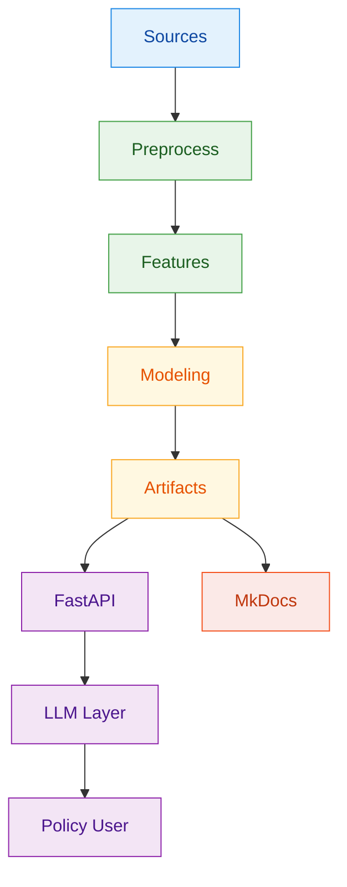
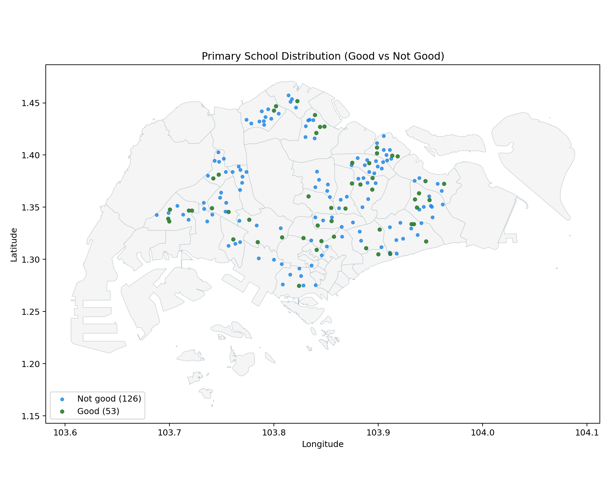
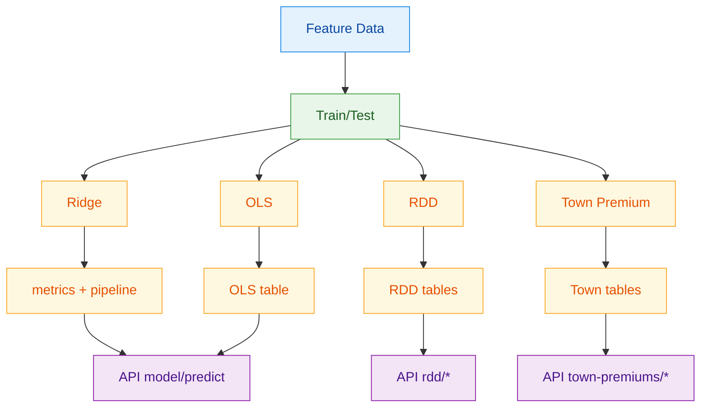

# Technical Report: Estimating the HDB Resale Price Effect of Proximity to Oversubscribed Primary Schools

## 1. Context

The Ministry of National Development (MND) is responsible for planning Singapore's land use and ensuring the provision of affordable and accessible public housing. In recent years, HDB resale prices have experienced upward pressure, driven by a combination of supply-demand dynamics and location-based preferences. One key factor influencing buyer behavior is proximity to desirable primary schools.

Under the admission framework administered by the Ministry of Education (MOE), priority is given to students living within specified distance bands, especially within 1km of a school. As a result, flats located near "good" primary schools are often perceived to command higher resale prices as households seek to secure admission advantages.

This motivates the core policy question: does proximity to "good" primary schools produce a measurable resale premium after controlling for other housing and location factors?

## 2. Scope

### 2.1 Problem

Despite widespread discussion, MND currently lacks a robust, data-driven estimate of the impact of proximity to "good" primary schools on HDB resale prices. Existing analyses often do not adequately control for confounding factors such as flat characteristics, transport accessibility, and neighborhood amenities, making it difficult to isolate the school-proximity effect.

Without a clear estimate, MND faces challenges in assessing whether school-driven demand is contributing to resale-market distortions and in designing proportionate policy responses. In addition, there is a product-accessibility requirement: non-technical policy officers need a natural-language interface to explore model predictions and findings without coding.

### 2.2 Success Criteria

Success criteria are defined at both business and operational levels.

Business-facing criteria is to produce interpretable effect sizes, revealing where school effects are heterogeneous instead of assuming a single national premium. THis is to  provide evidence that can support policy discussions on housing affordability, neighborhood demand pressure, and planning trade-offs.

Operational criteria is to build a reproducible geospatial feature pipeline, preserve traceability of design choices across scripts and branches.

### 2.3 Assumptions

This report and the current implementation rely on a set of material assumptions.

First, "good school" is operationalized primarily using the top 59 schools by overall subscription pressure (applicants/vacancies), with consideration to school characteristics such as programs (for example GEP and SAP) in the project curation process. Within our group, we discussed and added schools we feel are good as well. This produces a dataset that combines systematic ranking signals with judgment-based classification choices, resulting in a unique dataset.

Second, in the optimized OneMap routing pipeline, to reduce the number of required API calls, OneMap routing is reserved for nearest-distance features while threshold-count features use Euclidean approximations for tractability. This is an explicit engineering trade-off between route realism and runtime/quota constraints.

Finally, causal interpretation remains conditional. The baseline hedonic and local boundary designs reduce confounding but do not fully eliminate sorting effects, so effect estimates should be interpreted with specification awareness.

### 2.4 Stakeholder-to-Method Mapping

| Stakeholder | Core question | Method artifacts used |
|---|---|---|
| DS analyst (model owner) | Is predictive performance stable out-of-time? | `hedonic_model/outputs/metrics.json`, `feature_importance_top.csv` |
| DS reviewer (causal scrutiny) | Are estimated school effects specification-sensitive? | `diagnostic_outputs/good_school_sign_trace.csv`, `rdd_outputs/rdd_results.csv` |
| Policy and planning analyst | Are effects heterogeneous by local market? | `town_outputs/town_premium_results.csv` |
| Data engineering maintainer | Can the pipeline be rerun safely at scale? | `build_resale_flat_school_dataset_onemaps.py` chunked and append-safe pipeline |

### 2.5 Data

The pipeline integrates transactional, geospatial, and amenity datasets.

Data governance note: raw source data should be re-pulled from upstream providers (for example Kaggle, data.gov.sg, and scraping pipelines) instead of being treated as permanent versioned assets in the code repository.

| Data source | Role in pipeline | Public source link |
|---|---|---|
| HDB resale transactions (`2017+`) | Target variable and structural covariates | [data.gov.sg - Resale flat prices (from Jan 2017)](https://data.gov.sg/datasets/d_ebc5ab87086db484f88045b47411ebc5/view) |
| School subscription rankings | Good-school definition and school-tier labels | [MOE Primary 1 Registration](https://www.moe.gov.sg/primary/p1-registration) |
| URA Master Plan land use | Spatial entity assignment for school points |  |
| HDB existing building polygons | Polygon matching and exposure transfer |  |
| Mall points and MRT exits | Accessibility covariates | [Kaggle - Shopping Mall Coordinates](https://www.kaggle.com/datasets/karthikgangula/shopping-mall-coordinates), [Kaggle - MRT/LRT stations in Singapore](https://www.kaggle.com/datasets/lzytim/full-list-of-mrt-and-lrt-stations-in-singapore) |
| Engineered OneMap feature table | Final model-ready dataset |  |

Current coverage statistics in generated artifacts:

- Total schools in subscription table: `179`
- "Good schools" selected: `59`
- Shopping centres mapped: `155`
- MRT exits tagged: `597`
- HDB polygons loaded: `13,386`
- Resale address points matched to HDB polygons: `9,568`
- Unmatched address points: `28`

### 2.6 Required APIs and External Services

Two external services are used in this project workflow.

- OneMap routing API (`https://www.onemap.gov.sg/api/public/routingsvc/route`), used for nearest walking distance to malls and MRT stations. The project requires a valid OneMap access token (`ONEMAP_API_KEY`) in `.env`. Without this token, the OneMap distance-provider mode fails early by design.

- Kaggle dataset access (`kagglehub`) for sources used in preprocessing scripts are required, requiring local Kaggle authentication setup when rerunning data pulls.

- OpenAI key requirement: not required for the core preprocessing/model/API pipelines in this repository. It is only required if an external LLM application layer is added that calls OpenAI services.

## 3. Methodology

### 3.1 Technical Assumptions

The project makes some technical assumptions:

Spatial layers are normalized to WGS84 for ingestion and projected to SVY21 (`EPSG:3414`) where meter-based operations are required. This ensures consistent buffering and distance logic.

School boundaries are constructed by joining school points to URA master-plan land-use polygons, with de-duplication rules for repeated URA object IDs. From these cleaned polygons, 1 km and 2 km Euclidean buffers are generated. This comes from the assumption that data is shared across ministries in Singapore, requiring collaboration between URA, MOE and HDB.

For routing features, the OneMap implementation uses candidate pre-filtering by Euclidean radius and nearest-candidate cap (`k`). The latest optimization keeps OneMap calls for nearest mall and MRT distances while computing 10-minute count features from Euclidean thresholds. Additional deduplication groups repeated origin coordinates to reduce repeated API calls.

Model-side, resale price is modeled as `log(resale_price)` to stabilize variance and permit approximate percentage interpretation through `exp(beta)-1`. Time effects are absorbed through month fixed effects and location effects through town fixed effects in OLS specifications.

### 3.2 Implementation
The implementation evolved across branches in the repository:

| Branch | Role in project |
|---|---|
| [`Data-Preprocessing`](https://github.com/heehawww/DSA4264_Geospatial_Group6/tree/Data-Preprocessing) | Geospatial integration and feature engineering pipeline |
| [`Hedonic-Model`](https://github.com/heehawww/DSA4264_Geospatial_Group6/tree/Hedonic-Model) | Hedonic regression, boundary RDD, and town-level heterogeneous-effect analysis |

Within `Data-Preprocessing`, the core geospatial workflow is implemented in:

- [`primary_boundaries/join_primary_schools_to_ura_landuse.py`](https://github.com/heehawww/DSA4264_Geospatial_Group6/blob/Data-Preprocessing/primary_boundaries/join_primary_schools_to_ura_landuse.py)
- [`primary_boundaries/build_resale_flat_school_dataset_onemaps.py`](https://github.com/heehawww/DSA4264_Geospatial_Group6/blob/Data-Preprocessing/primary_boundaries/build_resale_flat_school_dataset_onemaps.py)

Within `Hedonic-Model`, model estimation is implemented in:

- [`hedonic_model/train_hedonic_model.py`](https://github.com/heehawww/DSA4264_Geospatial_Group6/blob/Hedonic-Model/hedonic_model/train_hedonic_model.py)
- [`hedonic_model/run_school_boundary_rdd.py`](https://github.com/heehawww/DSA4264_Geospatial_Group6/blob/Hedonic-Model/hedonic_model/run_school_boundary_rdd.py)
- [`hedonic_model/run_town_premium_models.py`](https://github.com/heehawww/DSA4264_Geospatial_Group6/blob/Hedonic-Model/hedonic_model/run_town_premium_models.py)

### 3.3 End-to-End Project Flow

### 3.4 School Location Distribution Map

To support visual validation of school-location coverage, we provide a static split map (green points = Good schools, blue points = Not good schools):

The map shows 179 school points across the island (`53` good, `126` not good in the joined point layer), with denser clusters in major residential belts. This is used as a QC check before downstream buffer and distance feature generation.

### 3.5 Model Workflow

The modelling stack combines methods with complementary strengths.

### 3.6 Model Selection and Experimental Design

Ridge regression is used as the primary predictive model because the feature space includes many correlated engineered covariates and one-hot encoded fixed effects. L2 regularization stabilizes coefficients under multicollinearity and improves out-of-sample generalization.

OLS is retained in parallel for coefficient interpretability. It provides directly readable terms for hypothesis discussion (for example, `good_school_within_1km` and `good_school_count_1km`) and supports fixed-effect specifications useful for decomposition and diagnostics.

RDD is added as a local identification stress test around the 1 km good-school boundary. It does not replace the pooled hedonic model; it checks whether local discontinuities remain after controls and bandwidth restrictions.

Town-specific models are included because pooled coefficients can mask heterogeneous local effects. In this project, the sign and magnitude of school-associated premiums differ materially across towns.

The experimental workflow has two layers: feature engineering and modelling.

At feature-engineering level, the sequence is:

1. Build school-boundary entities by joining school points to URA polygons.
2. Construct 1 km and 2 km school buffers and classify school tier.
3. Match resale address points to HDB polygons.
4. For each polygon-linked address, compute school exposure counts (`school_count_*`, `good_school_count_*`) by buffer intersection.
5. Compute accessibility features (nearest mall and MRT walking distance, and nearby amenity counts).
6. Export a transaction-level table with all engineered covariates.

At modelling level (`Hedonic-Model` branch), three complementary strategies are used:

1. Predictive plus interpretable hedonic models: Ridge for predictive stability and OLS for coefficient interpretation.
2. Boundary RDD around the good-school 1 km cutoff: local linear specifications with increasing bandwidths and controls.
3. Town-specific regressions: separate models for heterogeneous premium estimation by town.

This layered design is deliberate: the hedonic model gives broad association patterns, RDD provides a local validity stress test, and town-level models expose heterogeneity that pooled coefficients can hide.

Method alternatives were considered but not prioritized in this phase:

| Candidate approach | Why not primary in this phase |
|---|---|
| Single pooled OLS only | High interpretability but weaker predictive stability under multicollinearity |
| Tree boosting as core model | Strong predictive power but weaker direct coefficient interpretability for policy-facing effect decomposition |
| Full causal design only (no predictive model) | Better identification focus but loses practical forecasting and residual diagnostics benefits |
| One universal treatment premium | Empirically inconsistent with town-level heterogeneity observed in outputs |

These alternatives were tested conceptually, but did not improve model usefulness enough relative to the chosen stack in this project phase.

## 4. Findings

### 4.1 Results

The engineered dataset in active use contains `223,550` resale rows and 27 columns in the OneMap feature table. Key distributional statistics indicate broad exposure variation:

- Share of transactions with at least one good school within 1 km: `54.2%`
- Mean `good_school_count_1km`: `0.61`
- Mean `school_count_1km`: `3.63`
- Median nearest mall walking distance: `851 m`
- Median nearest MRT walking distance: `681 m`

Representative descriptive plots:

Transactions are concentrated in a few towns (notably Sengkang and Punggol), so pooled estimates are strongly shaped by these submarkets.

4-room and 5-room flats dominate the sample, so results are most representative of mass-market flat types.

The distribution is right-skewed with a high-price tail, supporting `log(resale_price)` modeling.

From hedonic outputs (`hedonic_model/outputs/metrics.json`):

| Metric | Value |
|---|---:|
| Train R2 (log scale) | 0.909 |
| Test R2 (log scale) | 0.915 |
| Test RMSE (SGD) | 58,568.63 |
| Test MAE (SGD) | 43,845.37 |
| OLS premium estimate for `good_school_within_1km` | -1.62% |

Model analysis protocol in the hedonic run:

- Temporal train-test split (no random shuffle): last 12 months held out.
- Training rows `200,744` (`89.8%`), test rows `22,806` (`10.2%`).
- Cross-validation was not used in this baseline; Ridge used fixed `alpha=1.0`.
- ANOVA-style global variance test from OLS: `F = 7887`, `Prob(F) = 0.00`, so regressors are jointly significant.

`Test R2 = 0.915` means about 91.5% of holdout variation in `log(resale_price)` is explained by the model; this is predictive fit, not causal proof. SMOTE was not used (`imblearn` not used; task is regression).

Key significant variables from OLS:

- `floor_area_sqm`: `+0.00834` (p < 1e-40)
- `storey_mid`: `+0.00742` (p < 1e-40)
- `ln_nearest_mrt_walking_distance_m`: `-0.02557` (p < 1e-40)
- `mrt_unique_lines_within_10min_walk`: `+0.03874` (p < 1e-40)
- `good_school_within_1km`: `-0.0164` (p < 1e-20)
- `good_school_count_1km`: `+0.0088` (p < 1e-9)
- `pscore` note: not included as a standalone continuous regressor in this baseline; it is used indirectly via good-school tier/count construction.

At the sample median resale price (about SGD 495k), `-1.62%` is roughly `-SGD 8.0k`, while `+0.88%` per additional good school within 1 km is roughly `+SGD 4.4k`. This sign inconsistency means policy teams should not rely on a single pooled premium.

From nested specification tracing (`good_school_sign_trace.csv`):

- Raw-only and partially controlled specs show negative coefficients.
- After adding time and town fixed effects, the sign can attenuate or flip.
- Adding full school-count terms reintroduces negative coefficient on the binary indicator, while marginal count effect remains positive.

Short consolidation table from boundary RDD (`hedonic_model/rdd_outputs/rdd_results.csv`):

| Specification | Bandwidth (m) | Sample size | Cutoff premium (%) | p-value |
|---|---:|---:|---:|---:|
| Uncontrolled | 100 | 32,185 | -1.71 | 0.0289 |
| Controlled | 100 | 32,185 | +0.34 | 0.1216 |
| School fixed effects | 100 | 32,185 | +0.24 | 0.2558 |

RDD specifications differ by control intensity: `Uncontrolled` uses treatment and running-variable terms only; `Controlled` adds structural/market covariates; `School fixed effects` adds school FE so identification is from within-school boundary variation.

Effect size and significance are strongly specification-sensitive, with uncontrolled estimates markedly more negative than controlled variants.

From town-level models (`town_premium_results.csv`):

- Estimated premium per additional good school within 1 km is heterogeneous:
  - strongest positive estimate observed in Geylang (`+7.56%`)
  - strongest negative estimate observed in Serangoon (`-8.02%`)
- Across 20 town models, 17 are significant at 5%, with both positive and negative signs represented.

Static planning-area sign map (`good_school_within_1km`; green positive, red negative):

Short read: signs are mixed (`10` positive, `15` negative, `3` near-zero), so effects are not uniformly positive. Core areas mapped from `CENTRAL AREA` are negative in this run. Positive-sign towns show higher average `good_school_count_1km` (`0.84` vs `0.60`), but this is associative, not causal.

Coefficient table: `docs/assets/data/town_good_school_within_1km_sign_summary.csv`.

## 5. Discussion, Recommendations, and Limitations

### 5.1 Discussion

Pooled effects are unstable across specifications, so "near a good school always raises prices" is not supported once richer controls are added. Town-level heterogeneity is also strong and mixed in sign, arguing against a single citywide premium.

Local boundary evidence weakens after controls versus uncontrolled comparisons, suggesting part of the raw discontinuity reflects local composition differences. School variables should be interpreted as one component of a broader spatial bundle with accessibility, structural attributes, and time-location effects.

### 5.2 Recommendations

For the next project phase, we recommend prioritizing four items.

1. Adopt a tiered reporting standard for policy users. Report pooled estimates together with town-specific ranges and uncertainty intervals to prevent over-generalization.

2. Strengthen identification before policy use. Continue RDD work with stricter local comparability checks, alternative bandwidth selectors, and placebo boundaries. If feasible, shift from address-point to finer geolocation.

3. Expand sensitivity analysis for school definitions. Re-estimate with alternate "good school" definitions (different top-N thresholds, phase-specific pressure metrics, and lag structures) and report robustness envelopes.

4. Operationalize reproducibility together with upstream data improvements. Keep the chunked OneMap pipeline and branch-separated architecture, add an explicit runbook with parameter manifests, improve source-system data quality where capture is weak, and prioritize procurement of missing but useful datasets that were not available in time for this phase.

Given current evidence, the safest policy-facing conclusion is that school proximity is associated with resale prices, but the sign and magnitude are context-dependent and model-sensitive. Policy interpretation should therefore use local and specification-aware estimates rather than one universal premium.

### 5.3 Limitations, Bias Risks, and Mitigations

Key technical limitations remain and should be considered when interpreting the outputs.

1. **Location granularity**: the pipeline uses address-level points rather than exact unit coordinates. This can blur boundary-near treatment assignment and attenuate local effects.
2. **School quality proxy risk**: top-59 oversubscription is one operational definition of "good school" and may embed demand-side perception effects not purely school-intrinsic quality.
3. **Spatial confounding**: school proximity is correlated with neighborhood attributes (transport, mature-town effects, redevelopment intensity). Fixed effects and controls reduce but cannot fully remove all confounding.
4. **Routing approximation mix**: nearest distance uses OneMap routing, while count-threshold features use Euclidean approximations for tractability. This introduces metric asymmetry in accessibility features.
5. **Sample selection effects**: rows without successful geocode and polygon match are dropped (`2,921` rows), which can introduce mild selection bias if missingness is systematic.

Current mitigations in the implementation include time and town fixed effects, nested specification tracing, local RDD checks under multiple bandwidths, and explicit chunked rerun logic for reproducibility. Future work should include robustness sweeps on school definitions, placebo-boundary tests, and finer geocoding where feasible.

## 6. System Architecture

### 6.1 Overview

The intended architecture has four layers: frontend, FastAPI backend, offline model artifacts, and an LLM query layer. The backend (`api` branch) handles retrieval, filtering, and inference; artifacts are precomputed offline and loaded at runtime.

### 6.2 Backend Design

Endpoints are grouped by function to separate observed data from model outputs.

Core model endpoints:

- `POST /predict`
- `GET /model/metrics`
- `GET /model/feature-importance`
- `GET /model/coefficients`
- `GET /model/coefficients/{term_name}`

Data endpoints:

- `GET /resales/raw`
- `GET /resales/schema`
- `GET /resales/summary`

Analytical endpoints:

- `GET /rdd/results`
- `GET /rdd/group-ttests`
- `GET /town-premiums`
- `GET /benchmarks/results`
- `GET /diagnostics/sign-trace`

### 6.3 Model Serving

Models are trained offline and served from serialized artifacts (`ridge_pipeline.pkl`, `metrics.json`, `ols_coefficients.csv`, and RDD/town-premium tables under `data/` on the `api` branch). Prediction requests are validated, defaults are applied for missing fields, features are engineered, and ridge inference is executed.

### 6.4 LLM Interface

Natural-language queries are mapped to endpoint intents and routed to backend/model outputs.
Flow: `User -> LLM/parser -> backend -> model/artifact -> response`.

## 7. Application (LLM App)

### 7.1 User Interface

Frontend code is not present in this branch.

### 7.2 Supported Queries

Example query classes:
- Prediction: "Estimate price of a 4-room flat in Tampines" -> `POST /predict`
- Policy insight: "How much do good schools affect prices?" -> `GET /model/coefficients` / `GET /rdd/results` / `GET /town-premiums`
- Scenario analysis: "Compare flats near and far from good schools" -> `GET /resales/summary`

### 7.3 Output Format

Outputs are JSON rendered as predicted price (with default warnings), school-premium signals, and concise explanatory text.

## 8. Deployment

### 8.1 Deployment Architecture

Deployment has two layers: MkDocs + GitHub Pages documentation, and FastAPI on the `api` branch (`/resales`, `/model`, `/rdd`, `/town-premiums`, `/diagnostics`, `/benchmarks`, `/predict`) using `data/` artifacts.

### 8.2 Containerisation

No Dockerfile/container configuration is present in this branch.

### 8.3 Running the Application

Backend run instructions:

1. Checkout branch `api`.
2. Install dependencies (`uv sync`).
3. Start backend: `uv run uvicorn api.main:app --reload` (or `uvicorn api.main:app --reload`).
4. Access API docs at `http://127.0.0.1:8000/docs`.

### 8.4 Optional Cloud Deployment

No cloud deployment configuration or public endpoint is documented in this repository.
