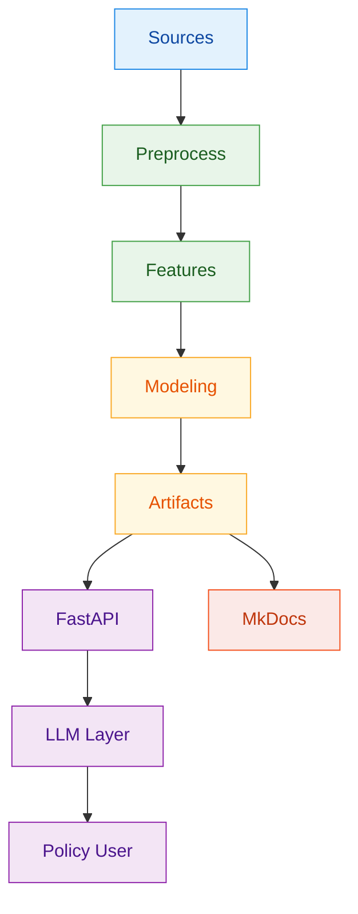
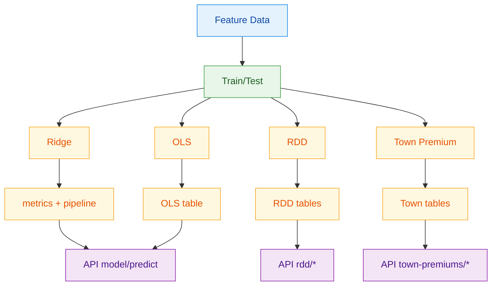
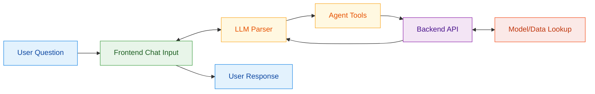

# Technical Report: Estimating the HDB Resale Price Effect of Proximity to Oversubscribed Primary Schools

# 1. Context

The Ministry of National Development (MND) plans Singapore's land use and public housing. HDB resale prices have risen due to supply-demand conditions and location preferences, including proximity to primary schools.

Under the Ministry of Education (MOE) admission framework, priority is given to students living within distance bands, especially within 1km. As a result, flats near "good" primary schools are often perceived to command higher prices.

This motivates the core policy question: does proximity to "good" primary schools produce a measurable resale premium after controlling for other housing and location factors?

# 2. Scope

### 2.1 Problem

Despite widespread discussion, MND lacks a robust estimate of the impact of proximity to "good" primary schools on HDB resale prices. Existing analyses often under-control for flat characteristics, transport accessibility, and neighborhood amenities, making the school-proximity effect hard to isolate.

Without a clear estimate, MND faces challenges in assessing school-driven demand distortions and designing proportionate policy responses. Non-technical policy officers also need a natural-language interface to explore model predictions without coding.

### 2.2 Success Criteria

Success criteria are defined at both business and operational levels.

Business-facing criteria is to produce interpretable effect sizes, revealing where school effects are heterogeneous instead of assuming a single national premium. THis is to  provide evidence that can support policy discussions on housing affordability, neighborhood demand pressure, and planning trade-offs.

Operational criteria is to build a reproducible geospatial feature pipeline, preserve traceability of design choices across scripts and branches.

### 2.3 Assumptions

This report and the current implementation rely on a set of material assumptions.

First, "good school" is operationalized using top schools by subscription pressure (applicants/vacancies), with additional curation based on school characteristics (for example GEP and SAP). This combines ranking signals with judgment-based classification.

Second, in the optimized OneMap routing pipeline, to reduce the number of required API calls, OneMap routing is reserved for nearest-distance features while threshold-count features use Euclidean approximations for tractability. This is an explicit engineering trade-off between route realism and runtime/quota constraints.

Finally, causal interpretation remains conditional. Baseline hedonic and boundary designs reduce confounding but cannot eliminate sorting effects, so estimates should be interpreted carefully.

### 2.4 Stakeholder-to-Method Mapping

Stakeholder mapping keeps outputs decision-focused across model owners, policy analysts, and data maintainers. Model owners prioritize diagnostics, policy analysts prioritize effect heterogeneity and uncertainty, and data maintainers prioritize rerun-safe pipelines and traceability.

### 2.5 Data and External Services

The pipeline uses transactional, geospatial, and amenity data from upstream providers.

| Feature | Description | Link |
|---|---|---|
| MRT Station Exits | MRT exit points plus MRT/LRT line metadata. | MRT locations: [data.gov.sg MRT dataset](https://data.gov.sg/datasets?query=MRT&resultId=d_b39d3a0871985372d7e1637193335da5); MRT lines: [Kaggle MRT/LRT stations in Singapore](https://www.kaggle.com/datasets/lzytim/full-list-of-mrt-and-lrt-stations-in-singapore) |
| Bus Stops | Bus-stop point layer. | [data.gov.sg bus stop locations](https://data.gov.sg/datasets/d_3f172c6feb3f4f92a2f47d93eed2908a/view) |
| Shopping Malls | Mall point layer. | [Kaggle shopping mall coordinates](https://www.kaggle.com/datasets/karthikgangula/shopping-mall-coordinates) |
| Supermarkets | Supermarket point layer. | [data.gov.sg supermarket locations](https://data.gov.sg/datasets/d_cac2c32f01960a3ad7202a99c27268a0/view) |
| Hawker Centres | Hawker-centre point layer. | [data.gov.sg hawker centre locations](https://data.gov.sg/datasets/d_a57a245b3cf3ec76ad36d55393a16e97/view) |
| Parks | Park geospatial layer. | [data.gov.sg parks dataset](https://data.gov.sg/datasets/d_0542d48f0991541706b58059381a6eca/view) |
| URA Master Plan | Land-use parcel layer for polygon assignment. | [data.gov.sg URA Master Plan dataset](https://data.gov.sg/datasets?query=URA+master&resultId=d_90d86daa5bfaa371668b84fa5f01424f) |
| HDB Existing Buildings | HDB building polygons for point-in-polygon matching. | [data.gov.sg HDB existing buildings dataset](https://data.gov.sg/datasets?query=HDB+building&resultId=d_16b157c52ed637edd6ba1232e026258d) |

Coverage:

- Total schools in subscription table: `179`
- "Good schools" selected: `44`
- Shopping centres mapped: `155`
- MRT exits tagged: `597`
- HDB polygons loaded / matched address points / unmatched: `13,386 / 9,568 / 28`

External services: OneMap routing (`ONEMAP_API_KEY`) and Kaggle access (`kagglehub`).

# 3. Methodology

### 3.1 Technical Assumptions

Spatial layers are normalized to WGS84 for ingestion and projected to SVY21 (`EPSG:3414`) where meter-based operations are required. This ensures consistent buffering and distance logic.

School boundaries are constructed by joining school points to URA master-plan land-use polygons, with de-duplication rules for repeated URA object IDs. From these cleaned polygons, 1 km and 2 km Euclidean buffers are generated. This comes from the assumption that data is shared across ministries in Singapore, requiring collaboration between URA, MOE and HDB.

For routing features, the OneMap implementation uses candidate pre-filtering by Euclidean radius and nearest-candidate cap (`k`). The latest optimization keeps OneMap calls for nearest mall and MRT distances while computing 10-minute count features from Euclidean thresholds. Additional deduplication groups repeated origin coordinates to reduce repeated API calls.

Model-side, resale price is modeled as `log(resale_price)` to stabilize variance and permit approximate percentage interpretation through `exp(beta)-1`. Time effects are absorbed through month fixed effects and location effects through town fixed effects in OLS specifications.

### 3.2 Implementation
The implementation evolved across branches in the repository:

| Branch | Role in project |
|---|---|
| [`Data-Preprocessing`](https://github.com/heehawww/DSA4264_Geospatial_Group6/tree/Data-Preprocessing) | Geospatial integration and feature engineering pipeline |
| [`Hedonic-Model`](https://github.com/heehawww/DSA4264_Geospatial_Group6/tree/Hedonic-Model) | Hedonic regression, boundary RDD, and town-level heterogeneous-effect analysis |

Within `Data-Preprocessing`, the core geospatial workflow is implemented in:

- [`primary_boundaries/join_primary_schools_to_ura_landuse.py`](https://github.com/heehawww/DSA4264_Geospatial_Group6/blob/Data-Preprocessing/primary_boundaries/join_primary_schools_to_ura_landuse.py)
- [`primary_boundaries/build_resale_flat_school_dataset_onemaps.py`](https://github.com/heehawww/DSA4264_Geospatial_Group6/blob/Data-Preprocessing/primary_boundaries/build_resale_flat_school_dataset_onemaps.py)

Within `Hedonic-Model`, model estimation is implemented in:

- [`hedonic_model/train_hedonic_model.py`](https://github.com/heehawww/DSA4264_Geospatial_Group6/blob/Hedonic-Model/hedonic_model/train_hedonic_model.py)
- [`hedonic_model/run_school_boundary_rdd.py`](https://github.com/heehawww/DSA4264_Geospatial_Group6/blob/Hedonic-Model/hedonic_model/run_school_boundary_rdd.py)
- [`hedonic_model/run_town_premium_models.py`](https://github.com/heehawww/DSA4264_Geospatial_Group6/blob/Hedonic-Model/hedonic_model/run_town_premium_models.py)

### 3.3 End-to-End Project Flow

### 3.4 Model Workflow

### 3.5 Model Selection and Experimental Design

Ridge regression is used as the primary predictive model because the feature space includes many correlated engineered covariates and one-hot encoded fixed effects. L2 regularization stabilizes coefficients under multicollinearity and improves out-of-sample generalization.

OLS is retained in parallel for coefficient interpretability. It provides directly readable terms for hypothesis discussion (for example, `good_school_within_1km` and `good_school_count_1km`) and supports fixed-effect specifications useful for decomposition and diagnostics.

RDD is added as a local identification stress test around the 1 km good-school boundary. It does not replace the pooled hedonic model; it checks whether local discontinuities remain after controls and bandwidth restrictions.

Town-specific models are included because pooled coefficients can mask heterogeneous local effects. In this project, the sign and magnitude of school-associated premiums differ materially across towns.

At feature-engineering level, the sequence is:

1. Build school-boundary entities by joining school points to URA polygons.
2. Construct 1 km and 2 km school buffers and classify school tier.
3. Match resale address points to HDB polygons.
4. For each polygon-linked address, compute school exposure counts (`school_count_*`, `good_school_count_*`) by buffer intersection.
5. Compute accessibility features (nearest mall and MRT walking distance, and nearby amenity counts).
6. Export a transaction-level table with all engineered covariates.

At modelling level (`Hedonic-Model` branch), three complementary strategies are used:

1. Predictive plus interpretable hedonic models: Ridge for predictive stability and OLS for coefficient interpretation.
2. Boundary RDD around the good-school 1 km cutoff: local linear specifications with increasing bandwidths and controls.
3. Town-specific regressions: separate models for heterogeneous premium estimation by town.

Method alternatives were considered but not prioritized in this phase:

| Candidate approach | Why not primary in this phase |
|---|---|
| Single pooled OLS only | High interpretability but weaker predictive stability under multicollinearity |
| Tree boosting as core model | Strong predictive power but weaker direct coefficient interpretability for policy-facing effect decomposition |
| Full causal design only (no predictive model) | Better identification focus but loses practical forecasting and residual diagnostics benefits |
| One universal treatment premium | Empirically inconsistent with town-level heterogeneity observed in outputs |

# 4. Findings

### 4.1 Results

The engineered dataset contains `223,550` resale rows and 27 columns.

- Share of transactions with at least one good school within 1 km: `54.2%`
- Mean `good_school_count_1km`: `0.61`
- Mean `school_count_1km`: `3.63`
- Median nearest mall walking distance: `851 m`
- Median nearest MRT walking distance: `681 m`

Transactions are concentrated in a few towns (notably Sengkang and Punggol), so pooled effects are shaped by these submarkets.

4-room and 5-room flats dominate the sample, so inference is strongest for mass-market segments.

Resale prices are right-skewed, supporting `log(resale_price)` to stabilize variance.

From hedonic model evaluation outputs:

| Metric | Value |
|---|---:|
| Train R2 (log scale) | 0.909 |
| Test R2 (log scale) | 0.915 |
| Test RMSE (SGD) | 58,568.63 |
| Test MAE (SGD) | 43,845.37 |
| OLS premium estimate for `good_school_within_1km` | -1.62% |

Model protocol:

- Temporal train-test split (no random shuffle): last 12 months held out.
- Training rows `200,744` (`89.8%`), test rows `22,806` (`10.2%`).
- Cross-validation was not used in this baseline; Ridge used fixed `alpha=1.0`.
- ANOVA-style global variance test from OLS: `F = 7887`, `Prob(F) = 0.00`, so regressors are jointly significant.

`Test R2 = 0.915` means 91.5% of holdout variation in `log(resale_price)` is explained; this is predictive fit, not causal proof.

Key significant variables from OLS:

- `floor_area_sqm`: `+0.00834` (p < 1e-40)
- `storey_mid`: `+0.00742` (p < 1e-40)
- `ln_nearest_mrt_walking_distance_m`: `-0.02557` (p < 1e-40)
- `mrt_unique_lines_within_10min_walk`: `+0.03874` (p < 1e-40)
- `good_school_within_1km`: `-0.0164` (p < 1e-20)
- `good_school_count_1km`: `+0.0088` (p < 1e-9)
- `pscore`: not used as a standalone regressor.

At the sample median price (about SGD 495k), `-1.62%` is about `-SGD 8.0k`, while `+0.88%` per additional good school within 1 km is about `+SGD 4.4k`.

Table 4.1 (school-specific local RDD sample) illustrates school-level heterogeneity:

| School Name | Group | Inside_n | Outside_n | Premium ($) Mean | Premium (%) |
|---|---|---:|---:|---:|---:|
| Admiralty Primary School | good | 832 | 261 | 7,512.06 | 1.4753 |
| Ahmad Ibrahim Primary School | nongood | 465 | 737 | -2,995.15 | -0.6386 |
| Ai Tong School | good | 331 | 428 | -12,607.10 | -2.2545 |
| Alexandra Primary School | nongood | 730 | 357 | 9,192.20 | 1.1975 |

School-level results are heterogeneous: several schools show positive boundary premiums, while others are weak or negative.

At the controlled `100m` bandwidth, grouped RDD showed a higher descriptive mean premium near good schools (`SGD 8,605`) than non-good schools (`SGD 4,803`). However, the pooled interaction-based controlled RDD did not find this difference statistically significant (`p = 0.138`).

- Raw-only and partially controlled specs show negative coefficients.
- After adding time and town fixed effects, the sign can attenuate or flip.
- Adding full school-count terms reintroduces negative coefficient on the binary indicator, while marginal count effect remains positive.

| Specification | Bandwidth (m) | Sample size | Cutoff premium (%) | p-value |
|---|---:|---:|---:|---:|
| Uncontrolled | 100 | 32,185 | -1.71 | 0.0289 |
| Controlled | 100 | 32,185 | +0.34 | 0.1216 |
| School fixed effects | 100 | 32,185 | +0.24 | 0.2558 |

RDD specifications differ by controls: `Uncontrolled` uses treatment and running-variable terms; `Controlled` adds structural/market covariates; `School fixed effects` adds school FE.

Effect size and significance are specification-sensitive, with uncontrolled estimates more negative than controlled variants.

- Estimated premium per additional good school within 1 km is heterogeneous:
  - strongest positive estimate observed in Geylang (`+7.56%`)
  - strongest negative estimate observed in Serangoon (`-8.02%`)
- Across 20 town models, 17 are significant at 5%, with both positive and negative signs represented.

Static planning-area sign map (`good_school_within_1km`; green positive, red negative):

Signs are mixed (`10` positive, `15` negative, `3` near-zero), so effects are not uniformly positive. Positive-sign towns show higher average `good_school_count_1km` (`0.84` vs `0.60`), but this is associative.

# 5. Discussion, Recommendations, and Limitations

### 5.1 Discussion

Pooled effects are unstable across specifications, so "near a good school always raises prices" is not supported once richer controls are added. Town-level heterogeneity is also strong and mixed in sign, arguing against a single citywide premium.

Local boundary evidence weakens after controls versus uncontrolled comparisons, suggesting part of the raw discontinuity reflects local composition differences. School variables should be interpreted as one component of a broader spatial bundle with accessibility, structural attributes, and time-location effects.

### 5.2 Recommendations

For the next phase, use the system as decision support, not a causal pricing engine.

1. Report pooled estimates together with town-level ranges and uncertainty intervals.
2. Strengthen identification using RDD robustness checks (alternative bandwidths, placebo boundaries, and finer geocoding).
3. Re-estimate sensitivity under alternative good-school definitions and improve upstream data quality.

Policy interpretation should remain local and specification-aware.

### 5.3 Limitations, Bias Risks, and Mitigations

Main limitations are location granularity (address points, not unit coordinates), school-quality proxy risk, residual spatial confounding, mixed distance metrics, and possible selection effects from dropped unmatched rows.

Current mitigations include time and town fixed effects, nested specification tracing, multi-bandwidth local RDD checks, and chunked rerun logic. Future work should prioritize finer geocoding, placebo-boundary tests, and school-definition robustness sweeps.

# 6. System Architecture

### 6.1 Overview

The architecture has four layers: frontend, FastAPI backend, offline model artifacts, and an LLM query layer.

### 6.2 Model Serving

Models are trained offline and served from serialized artifacts and precomputed analytical tables in the API data layer. Prediction requests are validated, defaults are applied for missing fields, features are engineered, and ridge inference is executed.

### 6.3 LLM Interface

